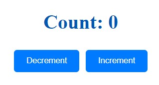

# Counter Application

## Description
This is a simple counter application that allows users to increment and decrement a counter value.

## Project Setup

### Backend

The backend server is built using Express and socketIo.

### Frontend

The frontend is developed using Vue.js.

## Installation

### Backend Setup

1. Navigate to the backend directory:
    ```sh
    cd backend
    ```

2. Install backend dependencies:
    ```sh
    pnpm install
    ```

3. Start the backend server:
    ```sh
    pnpm start
    ```

### Frontend Setup

1. Navigate to the frontend directory:
    ```sh
    cd frontend
    ```

2. Install frontend dependencies:
    ```sh
    pnpm install
    ```

3. Start the frontend development server:
    ```sh
    pnpm dev
    ```

## Running Tests

### Backend Tests

To run the backend tests, use the following command:
```sh
pnpm test:backend
```

### Frontend Tests

To run the frontend tests, use the following command:
```sh
pnpm test:frontend
```
## Screenshot


